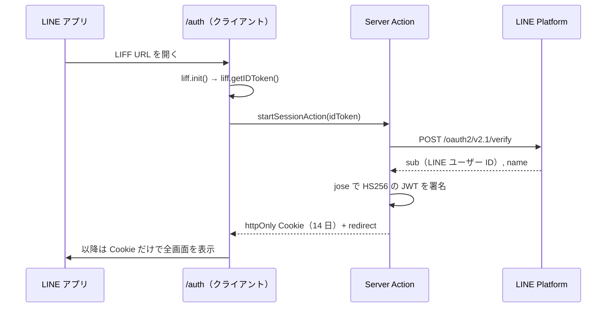

今回は、飲食店の会員向け LINE ミニアプリで採用した技術構成を紹介します。

2022 年にも LIFF + Next.js のテンプレートを公開しましたが、今回はログイン後の会員判定をサーバー側で行う構成に変えました。LIFF を使うのはログイン画面だけで、それ以降は自前のセッション Cookie を使っています。

認証の実装、管理画面との役割分担、開発・審査・本番の環境の分け方をまとめます。

:::message
本記事は業務システムの開発に伴走した記録です。クライアント名・プロダクト名・業務固有の用語は伏せ、ドメイン名やチャネル ID は架空の値に置き換えています。
:::

## このシリーズについて

2026 年 5 月末から 9 月半ばまでの開発内容を、4 本に分けて紹介する予定です。本記事では、2026 年 9 月時点で採用している構成を扱います。

1. **技術構成編**（本記事）。何を選び、どこで詰まったか
2. **アカウント準備編**。プロバイダー・チャネル・LIFF・公式アカウントを、結局いくつ作ったか
3. **開発編**。テスター制限の回避、並行開発、手元でのチェックとデプロイ確認
4. **審査と本番編**。審査用チャネルでの受け入れ、未認証のまま公開する判断、本番昇格の手順

## つくっていたもの

飲食店ブランドの会員向け LINE ミニアプリと、店舗スタッフ用の管理画面です。会員証・来店回数に応じたランク・クーポン・店舗一覧・予約・お知らせ。予約は外部の予約台帳 SaaS の API を経由して席を押さえます。

- **ミニアプリ**: Next.js 16.3（App Router、Cache Components、React Compiler）on Vercel
- **管理画面**: 同じ Next.js 16.3。別プロジェクト、別ドメイン
- **データ**: Supabase（Postgres）+ Prisma 7（Driver Adapters）
- **会員の認証**: LIFF で LINE ログインし、自前のセッション Cookie を発行
- **スタッフの認証**: Better Auth（メール OTP + パスキー）。メールは Resend
- **LINE 連携**: `@line/liff` 2.29 と `@line/bot-sdk` 11
- **モノレポ**: Turborepo + pnpm 11、Node 24
- **静的解析とテスト**: tsc + Biome + ESLint、Vitest、Playwright

`page.tsx` を数えると、ミニアプリが 10 画面、管理画面が 27 画面です。Prisma のモデルは 24 個。5 月 26 日の最初のコミットから数えて 404 コミット、稼働日は 47 日でした。

## ディレクトリ構成

```text
apps/
  miniapp   LINE ミニアプリ。会員だけが使う。全画面ログイン必須
  admin     管理画面。スタッフだけが使う。LINE の Webhook と Cron もここ
packages/
  schema    Prisma スキーマ、Prisma Client、Better Auth の設定
  features  ドメインロジック。値オブジェクト、キャッシュタグの定義
  library   外部 SDK のラッパー。LINE Bot SDK、予約台帳 API、ロガー
  ui        shadcn/ui ベースの共通コンポーネントとデザイントークン
```

ミニアプリは会員、管理画面はスタッフが使います。認証方法が違うことと、スタッフ向けの変更をミニアプリと別にデプロイしたかったことから、アプリを分けました。

LINE の Messaging API は管理画面側で扱っています。Webhook の受信、予約リマインドや来店後の配信を送る Cron、チャネルシークレットの管理をまとめました。ミニアプリ側では、LIFF によるログインとセッションの確認を行います。

## 会員の認証

最初に考えたのは「全画面で `liff.init()` を呼び、`liff.getProfile()` で会員を判定する」形でした。2022 年に公開した自分のテンプレートも、そういう作りです。

https://zenn.dev/yoshinani_dev/articles/2b101633bcbe31

今回は Server Components で会員のデータを取得したかったため、クライアント側の `liff.getProfile()` による判定から、サーバー側でセッションを確認する形に変えました。

ログイン画面で LIFF から ID トークンを取得し、サーバー側で検証してセッション Cookie を発行します。



クライアント側は、ログイン画面の 1 コンポーネントに閉じています。SDK は動的 import なので、他の画面のバンドルには入りません。

```tsx
// app/auth/_Auth.tsx（抜粋）
useEffect(() => {
  if (!liff) return

  // 外部ブラウザで未ログインなら LINE ログインへ送り出す
  if (!liff.isInClient() && !liff.isLoggedIn()) {
    liff.login({ redirectUri: window.location.href })
    return
  }

  const idToken = liff.getIDToken()
  // ID トークンをサーバーに渡し、検証と Cookie 発行はサーバーでやる
  void startSessionAction(idToken, redirectTo)
}, [liff, redirectTo])
```

サーバー側は、LINE の検証エンドポイントに ID トークンを投げるだけです。公式リファレンスの `client_id` は「期待されるチャネル ID」と書かれています。

```ts
// lib/liff/verify-token.ts（抜粋）
const resp = await fetch("https://api.line.me/oauth2/v2.1/verify", {
  method: "POST",
  headers: { "Content-Type": "application/x-www-form-urlencoded" },
  body: new URLSearchParams({ id_token: idToken, client_id: lineChannelId }),
})
```

このチャネル ID は LIFF ID の前半です。LIFF ID は `チャネル ID（数字 10 桁）-クライアント ID（英数字 8 桁）` の形なので、環境変数を読む時点で分解しておきます。

```ts
// env.ts（抜粋）。@t3-oss/env-nextjs + valibot
NEXT_PUBLIC_LIFF_ID: v.pipe(
  v.string(),
  v.regex(/^(\d{10})-(\w{8})$/, "LIFF ID はチャネル ID とクライアント ID をハイフンで繋いだもの"),
  // 前半のチャネル ID を ID トークン検証の client_id に使う
  v.transform((v) => v.split("-") as [string, string]),
),
```

検証が通ったら、`sub`（LINE のユーザー ID）だけを載せた JWT を `jose` で署名し、`httpOnly` の Cookie に入れます。有効期限は 14 日。以降の画面は `proxy.ts` がこの Cookie を検証するだけで、LINE には問い合わせません。

### 外部ブラウザでのログインループ

外部ブラウザで開いたときだけ、ログイン画面と LINE ログインの間を往復し続ける現象が出ました。

`liff.login({ redirectUri })` の戻り先は、LINE 側で LIFF のエンドポイント URL（このアプリではルート）に正規化されます。元のパスは `liff.state` に押し込まれ、コールバックは `/?liff.state=/mypage&code=...&state=...` の形でルートに着地します。

ここで私は、ルートに来た未認証リクエストを `/auth` へ**リダイレクト**していました。すると `code` が消えます。`/auth` は改めて `liff.login()` を呼び、LINE は新しい `code` を発行し、またルートに戻ってきます。

コールバックのクエリを残した状態で `liff.init()` を実行するため、ここを **rewrite** に変えました。URL を変えずに `/auth` を描画するようにしています。

```ts
// features/auth/usecase/proxy.ts（抜粋）
// code / state を持つ着地は LINE ログインのコールバック。
// リダイレクトすると code が失われ、/auth が再び login() を呼ぶ無限ループになる。
if (isLoginCallback(req)) {
  return NextResponse.rewrite(new URL(`/auth${req.nextUrl.search}`, req.nextUrl))
}
```

念のため、`liff.login()` へ送り出した回数を `sessionStorage` に記録し、2 回目に戻ってきたらループを止めてエラー画面を出すようにもしています。

### ディープリンクの処理

`https://miniapp.line.me/<LIFF_ID>/mypage` のように、パス付きの LIFF URL で開いても、必ずトップページが表示されました。

LINE はパス付き URL を、エンドポイント URL に `?liff.state=/mypage` を付けた形で着地させます。本来は LIFF SDK が `liff.state` を読んで遷移しますが、この構成では SDK は `/auth` でしか初期化されません。そのため、ログイン済みでルートに戻ったときに `liff.state` が処理されていませんでした。

`proxy.ts` で `liff.state` を本来のパスへ正規化するようにして解決しました。今回の構成では、ログインのコールバックとディープリンクの両方をアプリ側で扱っています。

## ローカル開発用の認証

開発中に毎回 LINE でログインする手間を省くため、`NEXT_PUBLIC_TEST_USER_ID` を設定したときだけ、`proxy.ts` が認証を素通しし、その ID の会員として動くようにしました。

```ts
// proxy.ts（抜粋）
export async function proxy(req: NextRequest) {
  // ローカル開発ではテスト用の会員 ID で認証を省略する
  if (env.NEXT_PUBLIC_TEST_USER_ID) return NextResponse.next()
  return await authProxy(req)
}
```

2022 年のテンプレートでは LIFF Mock を使っていました。今回はセッションの境界をサーバーに置いたので、モックする対象が SDK ではなく「誰としてログインしているか」に変わりました。こちらのほうが小さく済みます。

## 開発・審査・本番の環境

LINE ミニアプリのチャネルは、コンソールでは 1 つに見えて内部は 3 つです。公式ドキュメントの言葉を借りると、開発用・審査用・本番用の「内部チャネル」で、それぞれに LIFF ID が付きます。

Git のブランチと Vercel の環境を、この 3 つに揃えました。

| ブランチ | 役割 | Vercel | LIFF ID | 誰が開けるか |
| --- | --- | --- | --- | --- |
| `develop` | 開発 | Preview（`develop` 用の環境変数） | 開発用 | チャネルの Admin と Tester |
| `staging` | 審査・受け入れ | Preview（`staging` 用の環境変数） | 審査用 | チャネルの Admin と Tester |
| `main` | 本番 | Production | 本番用 | 誰でも |

Vercel はブランチごとに Preview の環境変数を分けられるので、`NEXT_PUBLIC_LIFF_ID` と `NEXT_PUBLIC_APP_URL` をブランチ単位で持っています。ID トークンの検証はチャネル ID で行うため、利用する LIFF と検証に使うチャネル ID が対応するように、環境ごとに設定しています。

### クライアントが確認するための検証環境

開発用と審査用の LIFF は、チャネルの Admin または Tester に登録された LINE アカウントでしか開けません。LINE ログインのドキュメントにこうあります。

> チャネルが「開発中」の場合は、AdminまたはTesterの権限を持つユーザーのみがLINEログインを利用できます。

クライアントの担当者に「開発版を触ってください」と URL を送っても、開けません。Tester 招待はメール経由で、担当者が増えるたびに手続きが要ります。

担当者ごとの Tester 招待を省くため、検証用のミニアプリチャネルを別に作りました。その本番用 LIFF のエンドポイントを `dev.example.com` に向けています。 未認証のミニアプリは審査なしで本番用 LIFF を公開できるので、誰でも開けます。本チャネルの開発用 LIFF は、開発者のテスター確認用に温存しました。

結果として、ミニアプリのチャネルは 2 つ、LIFF は 6 本になりました。この数え上げはアカウント準備編で表にします。

## Supabase と Prisma の接続

Prisma 7 は Driver Adapters が必須なので、`@prisma/adapter-pg` で `pg` を挟みます。接続先は 2 系統です。実行時は 6543 番のプーラー（`DATABASE_URL`）、マイグレーションは 5432 番の直結（`DIRECT_URL`）。PgBouncer 経由では DDL が通らないので分けています。

```ts
// packages/schema/src/client.ts
// Prisma 7 は Driver Adapters が必須。next build 中のモジュール評価でも安全に通す
const adapter = new PrismaPg({ connectionString: process.env.DATABASE_URL })
export const client = globalForPrisma.prisma || new PrismaClient({ adapter })
```

Vercel の実行リージョンは `hnd1`（東京）を明示しています。Supabase が東京なのに、Vercel の既定値は米国東部でした。この話は別の記事に書いたので、ここでは結論だけです。

https://zenn.dev/yoshinani_dev/articles/3f9a1c7e08b24d

### ビルド時の DB 接続

店舗一覧やお知らせのような公開カタログは `"use cache"` に載せています。すると `next build` の「Generating static pages」で Prisma が本当に DB へ接続します。それまでは全ページが動的だったので、ビルド環境から DB に届かなくても通っていました。

`DATABASE_URL` が「設定されている」だけでは足りず、「ビルド環境から到達できる」が条件になります。IP 制限やプーラーの URL を疑う場所が 1 つ増えました。

### DB パスワード変更時の対応

ミニアプリと管理画面は同じ Supabase を見ています。7 月に DB のパスワードをローテーションしたところ、Vercel 側の環境変数が旧値のままで、両方が同時に落ちました。ミニアプリは真っ白、管理画面は OTP が「送信中」のまま止まります。

Vercel の両プロジェクトで環境変数を更新し、再デプロイして復旧しました。8 月に管理画面だけで再発したときも、Vercel 側に古い値が残っていました。ローカルでは 3 つの接続確認が通っていたので、デプロイ先の設定も確認する必要がありました。

## 公開データのキャッシュ

全画面がログイン必須なので、共有キャッシュに載せられるのは店舗・ランク・お知らせ・クーポンのような公開データだけです。会員情報は React の `cache()` でリクエスト内だけ共有し、リクエストをまたぐキャッシュには入れません。

管理画面で店舗を直したときは、`after()` からミニアプリの `/api/cache/revalidate` を叩き、許可した 7 種類のタグだけ `revalidateTag(tag, { expire: 0 })` で失効させます。別デプロイなので `updateTag` は使えません。

キャッシュする対象と更新方法は、前回の記事に詳しく書きました。

https://zenn.dev/yoshinani_dev/articles/9b4c17e2ad6f30

## スタッフの認証は LINE と別にする

管理画面は Better Auth です。メールに 6 桁のコードを送る `emailOTP` と、WebAuthn の `passkey`。サインアップは塞ぎ、招待されたスタッフだけがログインできます。

```ts
// packages/schema/src/auth.ts（抜粋）
emailAndPassword: {
  enabled: true,
  // 入口はスタッフ招待だけ。公開のサインアップは塞ぐ
  disableSignUp: true,
  requireEmailVerification: true,
},
plugins: [
  // メールに 6 桁コードを送ってログインする。5 分で失効
  emailOTP({ otpLength: 6, expiresIn: 300, disableSignUp: true, /* ... */ }),
  // 2 回目以降はパスキー
  passkey({ rpName: "管理画面", rpID: relyingParty().rpID, origin: relyingParty().origin }),
  nextCookies(),
],
```

管理画面は PC で使います。また、スタッフの個人 LINE アカウントに業務用のログインを依存させたくなかったので、メールとパスキーを採用しました。

### ログイン後の画面で発生したエラー

9 月半ばに、本番・審査・開発の管理画面が同時に「読み込みに失敗しました」になりました。ビルドは成功、型チェックも lint もテストも緑です。

原因は、`"use client"` を付けたモジュールから export した純粋関数を、サーバーコンポーネントのレイアウトで呼んでいたことでした。**`"use client"` モジュールの export は、すべてクライアント参照になります。** サーバーから呼ぶと実行時に落ちます。型チェッカも lint も、この境界は見ていません。

管理画面のレイアウトは認証後にしか評価されないので、ビルド時にも未認証リクエストでも壊れが表に出ません。切り分けは `vercel logs <url> --json` で生の例外を読むところからでした。ログで呼び出し元を確認し、純粋関数を `"use client"` のないモジュールへ移しました。

## Webhook と定期配信

Messaging API の Webhook は管理画面の Route Handler で受けます。署名を検証したうえで、友だち追加のイベントなら会員行を用意します。

```ts
// apps/admin/app/api/line/webhook/route.ts（抜粋）
const signature = req.headers.get("x-line-signature") ?? ""
const body = await req.text()
// 署名が合わない Webhook は読まない
if (!validateSignature(body, env.LINE_CHANNEL_SECRET, signature)) {
  return new NextResponse("invalid signature", { status: 401 })
}
```

配信は Vercel Cron で 4 本です。予約台帳との同期、予約リマインド、来店後のお礼、ステップ配信。すべて管理画面の `vercel.json` に書き、`CRON_SECRET` で守っています。

```json
{
  "crons": [
    { "path": "/api/cron/booking-sync", "schedule": "0 0 * * *" },
    { "path": "/api/cron/reservation-reminders", "schedule": "0 1 * * *" },
    { "path": "/api/cron/post-visit-thanks", "schedule": "0 2 * * *" },
    { "path": "/api/cron/step-campaigns", "schedule": "0 3 * * *" }
  ],
  "regions": ["hnd1"]
}
```

Messaging API のアクセストークンとチャネルシークレットは、管理画面側だけに設定しています。ミニアプリも DB 接続情報やセッション鍵は持ちますが、配信用の認証情報を両方に設定する必要はありません。

## 外部の予約 API との連携

予約台帳 SaaS の API は、`packages/library` にラッパーを置き、レスポンスを valibot で検証してから返します。例外は投げず、`TaggedError` で返します。

サンドボックスで実測したレスポンスの形を、そのままスキーマにしました。ドキュメントと実物がずれていた箇所（`pax` と `datetime` が必須で、`num_people` では 400 になる）は、スキーマのコメントに残しています。

API キーが未設定なら連携を行わず、自社 DB だけで予約が完結します。段階的に有効化できるようにするためです。予約台帳への登録が失敗したときは自社 DB に書きません。席が取れていないのに予約済みと見せないためです。

## テストとデプロイの確認

GitHub Actions の lint と test は途中で廃止しました。残っているのは PR の自動ラベルだけです。代わりに、PR を出す前に手元で必ず両方を通します。

```bash
pnpm --filter miniapp run check:ci && pnpm --filter miniapp run test:ci
```

`check:ci` は `next typegen` → `tsc --noEmit` → `biome check` → `eslint --max-warnings 0`。`test:ci` は Vitest です。遷移の速さは Playwright の `instant()` で固定し、境界を上に動かすと落ちるようにしています。

### 本番ビルドでの確認

このゲートには `next build` が入っていません。9 月にアイコンを差し替えた PR で、ミニアプリと管理画面の本番ビルドが両方落ちました。`favicon.ico` の PNG フレームが RGB で、Turbopack の ICO デコーダが拒否したのです。この問題は手元の型チェック・lint・テストでは検出できていませんでした。RGBA で生成し直して対応しました。

稼働中の本番は前回の Ready が生き続けるので、即障害にはなりません。ただし、以降のデプロイが全部止まります。CI が無い以上、**`main` にマージしたら Vercel の Production が Ready になるまで見届ける**のが運用です。

## まとめ

今回は、会員向けミニアプリとスタッフ用の管理画面を分けた構成を紹介しました。LIFF を使う範囲をログイン画面に絞ったぶん、コールバックやディープリンクの処理は自分たちで用意しています。

次回はアカウント準備編です。プロバイダーの下に作ったミニアプリチャネル、Messaging API チャネル、公式アカウントの関係をまとめます。

## 参考

- [LINEミニアプリ開発の概要 | LINE Developers](https://developers.line.biz/ja/docs/line-mini-app/develop/develop-overview/)
- [LINEログインを始めよう | LINE Developers](https://developers.line.biz/ja/docs/line-login/getting-started/)
- [LINEログイン v2.1 APIリファレンス（IDトークンを検証する） | LINE Developers](https://developers.line.biz/ja/reference/line-login/#verify-id-token)
- [LIFF SDK | LINE Developers](https://developers.line.biz/ja/docs/liff/developing-liff-apps/)
- [Cache Components | Next.js](https://nextjs.org/docs/app/getting-started/cache-components)
- [revalidateTag | Next.js](https://nextjs.org/docs/app/api-reference/functions/revalidateTag)
- [Driver adapters | Prisma](https://www.prisma.io/docs/orm/overview/databases/database-drivers)
- [Email OTP | Better Auth](https://www.better-auth.com/docs/plugins/email-otp)
- [Passkey | Better Auth](https://www.better-auth.com/docs/plugins/passkey)
