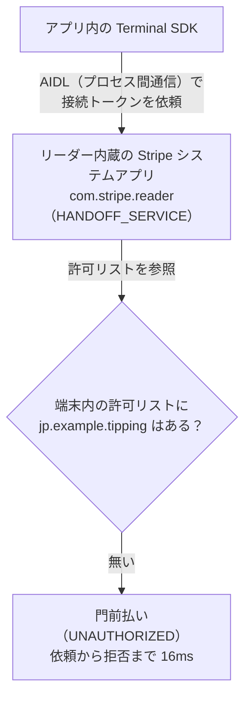

Stripe Terminal の **Apps on Devices（AoD）** を使って、リーダー実機（S700 / S710）上で動くチップ決済アプリを本番稼働させるまでの奮闘記です。

結論から言うと、`Could not connect to Stripe` という一見「ネットワーク障害」にしか見えないエラーの真因は、**Stripe 側のプロビジョニング不備**でした。そこに辿り着くまでの切り分けと、本番稼働にこぎつけたワークアラウンドを、探偵譚として残しておきます。

同じ AoD × ベータ機能で詰まっている人の時短になれば嬉しいです。


:::message
本記事はチップ決済アプリの開発に伴走した記録です。クライアント名・店舗名・アカウント ID・パッケージ名などは伏せ、パッケージ名は `jp.example.tipping` のようなプレースホルダに置き換えています。
:::

姉妹記事として、Stripe Terminal 本体のセットアップでハマった話も書いています。あわせてどうぞ。

https://zenn.dev/line_ec_lea/articles/8ae08d45273a9a

## つくっていたもの

あるインバウンド向け飲食店グループ向けに、**チップ決済アプリ**を開発していました。海外からの来店客が多く、「チップを渡す文化に対応したい」というのが発端です。

技術構成はこんな感じです。

- **アプリ**: React Native + `@stripe/stripe-terminal-react-native`（Apps on Devices 対応ベータ版）。Stripe Reader S700 / S710 上でネイティブ Android アプリとして動作
- **バックエンド**: Next.js（App Router）on Vercel + Supabase（Postgres / Prisma）。PaymentIntent 作成・Webhook 受信・接続トークン供給を担当

決済フローはシンプルです。

1. スタッフが金額を入力
2. 客に端末を渡す
3. 客が言語を選択
4. チップを選択（0 / 10 / 15 / 20% など）
5. 内容を確認
6. カードをタッチして決済

Apps on Devices は、Stripe Reader そのものの上でアプリを走らせられる機能です。専用の POS 端末を別途用意する必要がなく、リーダー 1 台で「金額入力 → チップ選択 → 決済」まで完結できるのが魅力でした。

## 事件発生：カード読取画面に到達できない

DevKit の実機でチップ決済を実行すると、**カード読取画面に到達する前に必ず失敗**します。金額を入れて確認まで進むのに、いざ「カードをタッチ」の直前で決済が始まらない。

最初、アプリはこのエラーを握り潰していました。表面化させてみると、こう出ます。

```
easyConnect: Could not connect to Stripe. Please retry
error code: STRIPE_API_CONNECTION_ERROR
```

`STRIPE_API_CONNECTION_ERROR`。文字通りに読めば「Stripe API への接続に失敗した」——つまりネットワークの問題に見えます。ここから長い切り分けが始まりました。

## 消去法：容疑者を一人ずつ潰す

「接続エラー」なのだから、まずは接続まわりを疑うのが定石です。片っ端から潰していきました。

### 容疑者1: ネットワーク → シロ

Stripe Reader には内蔵の診断機能があります。DNS 解決・Stripe への接続性・Terminal イベント接続性のすべてが **全項目パス**。ネットワークは生きています。

### 容疑者2: 接続トークンの取得 → シロ

AoD の初期化（`initialize()`、接続トークンの取得）は **成功** していました。少なくとも初期化フェーズでは Stripe と会話できている。

### 容疑者3: SDK の使い方 → シロ

公式ドキュメント通り、`easyConnect` に AoD の discovery method を渡しているだけです。型的にも間違いはありません。

```ts
await terminal.easyConnect({
  discoveryMethod: "appsOnDevices",
});
```

### 容疑者4: SDK のバージョン → シロ

コア Android SDK を `5.5.1` から公式推奨の `5.7.0` に上げても再現。バージョン起因ではありません。

### 容疑者5: 接続方式 → シロ

`easyConnect` の一発接続だけでなく、旧来の `discoverReaders` → `connectReader` の 2 段階接続でも **同じエラー**。接続 API の呼び方の問題でもない。

### 容疑者6: ネイティブ設定 → シロ

`AndroidManifest.xml` の `INTERNET` 権限、`MainApplication` での `TerminalApplicationDelegate.onCreate` の呼び出し——AoD / Terminal SDK が要求するネイティブ設定もすべて正しく入っていました。

### 決定打: 2台の別端末で同一エラー

極めつけは、**S710 DevKit** と **本番用 S700** という異なる 2 台で、まったく同じエラーが再現したこと。

端末の個体不良なら、2 台同時に同じ壊れ方はしません。これで容疑は「端末個体」から外れ、**アカウント単位の問題**である可能性が濃厚になりました。

コードは正しい。ネットワークも生きている。でも決済できない。ここで手詰まりになりました。SDK が返すエラーメッセージは `Could not connect to Stripe` の一点張りで、それ以上何も教えてくれません。

## adb logcat：包装紙の下の本当のエラー

DevKit の利点は、**USB デバッグができる**ことです。SDK の親切なメッセージがダメなら、その下のネイティブ層のログを直接覗けばいい。

`adb logcat` を流しながら、決済をもう一度実行しました。すると、`Could not connect to Stripe` という包装紙の下から、本当のエラーが顔を出しました。

```
RPC application error UNAUTHORIZED with message
CreateConnectionToken is not enabled for package: jp.example.tipping
```

`UNAUTHORIZED`。`CreateConnectionToken is not enabled for package`。

これは「ネットワークに繋がらない」エラーではありません。**「このパッケージには接続トークンの発行を許可していない」という認可（authorization）の拒否**です。メッセージが完全にすり替わっていました。

### 何が起きているのか（AoD の内部構造）

ここで AoD の内部構造を理解すると腑に落ちます。



AoD では、アプリが直接 Stripe サーバに接続トークンを取りに行くのではありません。**リーダー内蔵の Stripe システムアプリ `com.stripe.reader`（HANDOFF_SERVICE）** に AIDL 経由で「接続トークンをくれ」と依頼し、リーダーが端末内の許可リストを見て応じる、という仕組みです。

そして、その許可リストに我々のパッケージが載っていなかった。

### 決定的証拠は「速さ」だった

logcat のタイムスタンプを見て、確信に変わりました。**依頼から拒否まで 16ms**。

考えてみてください。もしこれが本当に Stripe サーバへ問い合わせに行った結果の拒否なら、TLS ハンドシェイクを含む往復で最低でも 100ms 超はかかるはずです。16ms で返ってくる拒否は、物理的にネットワーク往復では不可能です。

つまりこの拒否は、**サーバに聞きに行くまでもなく、端末ローカルの許可リストだけで即座に弾かれている**。ネットワークの問題ではないことが、レイテンシという物理から確定しました。


### 根本原因: Stripe 側のプロビジョニング不備

整理すると、こういうことでした。

- AoD 機能の「有効化」で、ダッシュボード側の機能（アプリのアップロード・デプロイ）は開通していた
- しかし「**このパッケージに、リーダー上で接続トークンの発行を許可する**」という設定が、リーダー群に配信されていなかった

ダッシュボードで AoD が「有効」に見えても、リーダー端末側の許可リストへの反映が抜け落ちていた、という **Stripe 側のプロビジョニング不備** です。

logcat の該当ログを添えて、Stripe サポートにエスカレーションしました。

## ワークアラウンド：壊れていない窓口を使う

サポートの対応を待つ間、本番稼働の予定は迫っていました。ここで、切り分けの成果が効いてきます。

**壊れていたのは「リーダーから接続トークンをもらう窓口」だけ** です。Stripe アカウント自体は生きているし、PaymentIntent の作成も、決済処理そのものも問題ないはずです。

AoD の標準は「リーダー自身がトークンを供給する」方式（`AppsOnDevicesConnectionTokenProvider`）ですが、**そこを通さず、接続トークンを自前バックエンドから供給する** ことにしました。

これは Terminal の標準統合とまったく同じやり方です。バックエンドで `POST /terminal/connection_tokens` 相当のエンドポイントを立て、`stripe.terminal.connectionTokens.create()` を呼ぶだけ。

```ts
// app/api/terminal/connection-token/route.ts
import { NextResponse } from "next/server";
import Stripe from "stripe";

const stripe = new Stripe(process.env.STRIPE_SECRET_KEY!);

export async function POST() {
  const connectionToken = await stripe.terminal.connectionTokens.create();
  return NextResponse.json({ secret: connectionToken.secret });
}
```

アプリ側は、AoD 標準の `AppsOnDevicesConnectionTokenProvider` の代わりに、この API を叩く標準的な `tokenProvider` を使います。

```ts
// 壊れている「リーダー経由の認可」をバイパスし、
// バックエンド供給のトークンで接続する
const fetchTokenFromBackend = async () => {
  const res = await fetch(`${BACKEND_URL}/api/terminal/connection-token`, {
    method: "POST",
  });
  const { secret } = await res.json();
  return secret;
};
```

こうして、**壊れた認可経路（リーダー内蔵の許可リスト）を迂回** した結果——接続が確立し、カード読取・決済処理まで正常に動作しました。本番稼働にこぎつけたのです。

### フラグ1つで標準経路に戻せるようにした

このワークアラウンドはあくまで暫定です。Stripe 側の修正が入れば、本来の AoD 標準経路（リーダー供給トークン）に戻したい。

そこで、**フラグ 1 つで接続トークンの供給元を切り替えられる設計** にしておきました。

```ts
// Stripe 側の修正が入ったら USE_BACKEND_TOKEN を false に戻すだけ
const tokenProvider = USE_BACKEND_TOKEN
  ? fetchTokenFromBackend                 // 暫定: バックエンド供給
  : appsOnDevicesConnectionTokenProvider; // 本来: リーダー供給
```

プラットフォーム側の解決を待たずに前に進めて、直ったら 1 行で正道に戻れる。迂回路を持っておく価値がここにありました。

## おまけの落とし穴：第2の地雷

接続問題を突破して喜んだのも束の間、検証中に実カードをタッチしたら、今度は別のエラーが出ました。

```
card_declined
decline_code: test_mode_live_card
```

`test_mode_live_card`——「テストモードのリーダーに、ライブのカード（PaymentIntent）」という不一致です。

原因は、バックエンドの `STRIPE_SECRET_KEY` が **本番キー（`sk_live_...`）のまま** だったこと。リーダーはテストモードで動いているのに、バックエンドがライブの PaymentIntent を作っていたので、モードが噛み合わずに弾かれていました。

接続問題とはまったく別の、**第 2 の地雷** でした。テストモードで検証するなら、バックエンドのキーもテストキー（`sk_test_...`）に揃える。当たり前ですが、接続エラーの沼にハマっている最中だと見落としがちです。

## 学び

3 日かけた奮闘から得た教訓です。

### 1. 親切なエラーメッセージが真因を隠すことがある

`Could not connect to Stripe` は、実際には `UNAUTHORIZED（接続トークン発行が許可されていない）` でした。SDK が「わかりやすく」抽象化したメッセージが、かえって真因を覆い隠していたのです。詰まったら遠慮なく、ネイティブ層のログ（`adb logcat`）まで降りましょう。

### 2. 曖昧なメッセージを鵜呑みにしない。切り分けの決め手は「速さ」だった

「接続エラー」と言われると反射的にネットワークを疑いますが、**16ms という異常な速さ** が「これはネットワーク往復ではない」と教えてくれました。レイテンシという物理は嘘をつきません。エラーメッセージの言葉より、観測できる事実を信じる。

### 3. ベータ機能 × 新しいプラットフォームでは、コードが正しくてもプラットフォーム側が原因になりうる

AoD は当時ベータでした。コードが公式ドキュメント通りに正しくても、**プラットフォーム側のプロビジョニング** が原因になることがあります。**異なる 2 台の端末で再現させる** ことで、「端末個体」ではなく「アカウント単位」の問題だと切り分けられました。同じ現象を複数の独立した経路で再現できると、原因の所在が絞れます。

### 4. 迂回路を持っておくと、プラットフォーム側の解決を待たずに前に進める

根本原因が Stripe 側にあると分かっても、それが直るまで指をくわえて待つ必要はありませんでした。**壊れている箇所（トークンの窓口）だけを迂回する** ワークアラウンドで、本番稼働にこぎつけられた。そして直ったら正道に戻せるよう、フラグ 1 つで切り替えられる設計にしておく。この「撤退可能な迂回路」を用意する発想が、締め切りとプラットフォームの都合の板挟みを救ってくれました。

## おわりに

Apps on Devices は、リーダー 1 台で決済体験を完結できる魅力的な機能です。ただ、ベータ期間中はプラットフォーム側の作り込みがまだ発展途上な部分もあり、「コードは正しいのに動かない」場面に出くわすことがあります。

そんなときは、エラーメッセージの言葉ではなく、`adb logcat` が見せてくれる生のログと、`16ms` のような観測事実を手がかりに切り分けていく——という、ごく地道な探偵仕事が効きました。同じところで詰まっている方の助けになれば幸いです。
