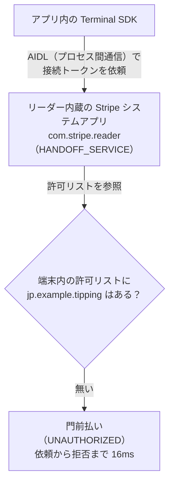

Stripe Terminal の Apps on Devices（AoD）で、リーダー実機上で動くチップ決済アプリを作りました。

その際、`Could not connect to Stripe` というエラーでカード読取画面に進めず、解決まで 3 日かかりました。ネットワークや SDK の設定を確認しても直らず、`adb logcat` で接続トークンの発行が拒否されていることが分かりました。

今回は、確認した内容とバックエンドからトークンを供給して対応した方法を紹介します。


:::message
本記事はチップ決済アプリの開発に伴走した記録です。クライアント名・店舗名・アカウント ID・パッケージ名などは伏せ、パッケージ名は `jp.example.tipping` のようなプレースホルダに置き換えています。
:::

姉妹記事として、Stripe Terminal 本体のセットアップでハマった話も書いています。あわせてどうぞ。

https://zenn.dev/line_ec_lea/articles/8ae08d45273a9a

## つくっていたもの

あるインバウンド向け飲食店グループ向けに、**チップ決済アプリ**を開発していました。海外からの来店客が多く、「チップを渡す文化に対応したい」というのが発端です。

技術構成はこんな感じです。

- **アプリ**: React Native + `@stripe/stripe-terminal-react-native`（Apps on Devices 対応ベータ版）。Stripe Reader S700 / S710 上でネイティブ Android アプリとして動作
- **バックエンド**: Next.js（App Router）on Vercel + Supabase（Postgres / Prisma）。PaymentIntent 作成・Webhook 受信・接続トークン供給を担当

決済フローはシンプルです。

1. スタッフが金額を入力
2. 客に端末を渡す
3. 客が言語を選択
4. チップを選択（0 / 10 / 15 / 20% など）
5. 内容を確認
6. カードをタッチして決済

Apps on Devices は、Stripe Reader そのものの上でアプリを走らせられる機能です。専用の POS 端末を別途用意する必要がなく、リーダー 1 台で「金額入力 → チップ選択 → 決済」まで完結できるのが魅力でした。

## カード読取画面に進めない

DevKit の実機でチップ決済を実行すると、**カード読取画面に到達する前に必ず失敗**します。金額を入れて確認まで進むのに、いざ「カードをタッチ」の直前で決済が始まらない。

最初、アプリはこのエラーを握り潰していました。表面化させてみると、こう出ます。

```
easyConnect: Could not connect to Stripe. Please retry
error code: STRIPE_API_CONNECTION_ERROR
```

`STRIPE_API_CONNECTION_ERROR`。文字通りに読めば「Stripe API への接続に失敗した」——つまりネットワークの問題に見えます。ここから長い切り分けが始まりました。

## 確認したこと

まず、ネットワークと SDK の設定を順番に確認しました。

### ネットワーク

Stripe Reader には内蔵の診断機能があります。DNS 解決・Stripe への接続性・Terminal イベント接続性のすべてが **全項目パス**。ネットワークは生きています。

### 初期化と接続トークンの取得

AoD の初期化（`initialize()`、接続トークンの取得）は **成功** していました。少なくとも初期化フェーズでは Stripe と会話できている。

### SDK の呼び出し方

公式ドキュメント通り、`easyConnect` に AoD の discovery method を渡しているだけです。型的にも間違いはありません。

```ts
await terminal.easyConnect({
  discoveryMethod: "appsOnDevices",
});
```

### SDK のバージョン

コア Android SDK を `5.5.1` から公式推奨の `5.7.0` に上げても再現。バージョン起因ではありません。

### 接続方式

`easyConnect` の一発接続だけでなく、旧来の `discoverReaders` → `connectReader` の 2 段階接続でも **同じエラー**。接続 API の呼び方の問題でもない。

### Android 側の設定

`AndroidManifest.xml` の `INTERNET` 権限、`MainApplication` での `TerminalApplicationDelegate.onCreate` の呼び出し——AoD / Terminal SDK が要求するネイティブ設定もすべて正しく入っていました。

### 別の端末でも確認した

S710 DevKit と本番用 S700 の 2 台で、同じエラーが再現しました。

1 台だけの問題ではなさそうだったので、共通して使っているアカウント側の設定も疑いました。

ここまで確認しても接続できませんでした。SDK から返るメッセージが同じままなので、これだけでは原因を絞れません。

## adb logcat でログを確認する

DevKit は USB デバッグができるので、ネイティブ側のログを確認することにしました。

`adb logcat` を流しながら、決済をもう一度実行しました。次のログが出ていました。

```
RPC application error UNAUTHORIZED with message
CreateConnectionToken is not enabled for package: jp.example.tipping
```

`UNAUTHORIZED`。`CreateConnectionToken is not enabled for package`。

これは「ネットワークに繋がらない」エラーではありません。**「このパッケージには接続トークンの発行を許可していない」という認可（authorization）の拒否**です。SDK の接続エラーだけでは、この内容が分かりませんでした。

### 何が起きているのか（AoD の内部構造）

ここで AoD の内部構造を理解すると腑に落ちます。



AoD では、アプリが直接 Stripe サーバに接続トークンを取りに行くのではありません。**リーダー内蔵の Stripe システムアプリ `com.stripe.reader`（HANDOFF_SERVICE）** に AIDL 経由で「接続トークンをくれ」と依頼し、リーダーが端末内の許可リストを見て応じる、という仕組みです。

そして、その許可リストに我々のパッケージが載っていなかった。

### ログで確認した応答時間

logcat では、依頼から拒否までが 16ms でした。`UNAUTHORIZED` の内容と合わせて、端末内の処理を調べる手がかりにしました。

ただし、この時間だけでネットワーク通信の有無を断定することはできません。拒否されているパッケージ名と、接続トークンの処理経路も確認しています。

### リーダー側の許可設定

整理すると、こういうことでした。

- AoD 機能の「有効化」で、ダッシュボード側の機能（アプリのアップロード・デプロイ）は開通していた
- しかし「**このパッケージに、リーダー上で接続トークンの発行を許可する**」という設定が、リーダー群に配信されていなかった

ダッシュボードで AoD が「有効」に見えても、リーダー端末側の許可リストへの反映が抜け落ちていた、という **Stripe 側のプロビジョニング不備** です。

logcat の該当ログを添えて、Stripe サポートにエスカレーションしました。

## バックエンドから接続トークンを供給する

サポートの対応を待つ間、本番稼働の予定は迫っていました。接続トークンの取得方法を変えて試すことにしました。

**壊れていたのは「リーダーから接続トークンをもらう窓口」だけ** です。Stripe アカウント自体は生きているし、PaymentIntent の作成も、決済処理そのものも問題ないはずです。

AoD の標準は「リーダー自身がトークンを供給する」方式（`AppsOnDevicesConnectionTokenProvider`）ですが、**そこを通さず、接続トークンを自前バックエンドから供給する** ことにしました。

これは Terminal の標準統合とまったく同じやり方です。バックエンドで `POST /terminal/connection_tokens` 相当のエンドポイントを立て、`stripe.terminal.connectionTokens.create()` を呼ぶだけ。

```ts
// app/api/terminal/connection-token/route.ts
import { NextResponse } from "next/server";
import Stripe from "stripe";

const stripe = new Stripe(process.env.STRIPE_SECRET_KEY!);

export async function POST() {
  const connectionToken = await stripe.terminal.connectionTokens.create();
  return NextResponse.json({ secret: connectionToken.secret });
}
```

アプリ側は、AoD 標準の `AppsOnDevicesConnectionTokenProvider` の代わりに、この API を叩く標準的な `tokenProvider` を使います。

```ts
// 壊れている「リーダー経由の認可」をバイパスし、
// バックエンド供給のトークンで接続する
const fetchTokenFromBackend = async () => {
  const res = await fetch(`${BACKEND_URL}/api/terminal/connection-token`, {
    method: "POST",
  });
  const { secret } = await res.json();
  return secret;
};
```

バックエンドからトークンを供給する形に変えると、接続できるようになりました。カード読取と決済も確認できたため、この構成で本番稼働させています。

### フラグ1つで標準経路に戻せるようにした

このワークアラウンドはあくまで暫定です。Stripe 側の修正が入れば、本来の AoD 標準経路（リーダー供給トークン）に戻したい。

そこで、**フラグ 1 つで接続トークンの供給元を切り替えられる設計** にしておきました。

```ts
// Stripe 側の修正が入ったら USE_BACKEND_TOKEN を false に戻すだけ
const tokenProvider = USE_BACKEND_TOKEN
  ? fetchTokenFromBackend                 // 暫定: バックエンド供給
  : appsOnDevicesConnectionTokenProvider; // 本来: リーダー供給
```

標準の取得方法が使えるようになったら、フラグを変えて戻せるようにしています。

## テストモードと本番キーの混在

接続後の検証で実カードをタッチしたところ、別のエラーも出ました。

```
card_declined
decline_code: test_mode_live_card
```

`test_mode_live_card`——「テストモードのリーダーに、ライブのカード（PaymentIntent）」という不一致です。

原因は、バックエンドの `STRIPE_SECRET_KEY` が **本番キー（`sk_live_...`）のまま** だったこと。リーダーはテストモードで動いているのに、バックエンドがライブの PaymentIntent を作っていたので、モードが噛み合わずに弾かれていました。

この環境では、リーダーのモードとバックエンドのキーが揃っているかも確認しました。接続エラーの対応に集中していて、こちらの設定を見落としていました。

## まとめ

SDK が返した接続エラーだけでは原因が分からず、`adb logcat` の `UNAUTHORIZED` が調査の手がかりになりました。

今回はバックエンドから接続トークンを供給する方法で対応しています。AoD で同じエラーが出た場合の、確認箇所の参考になれば幸いです。
